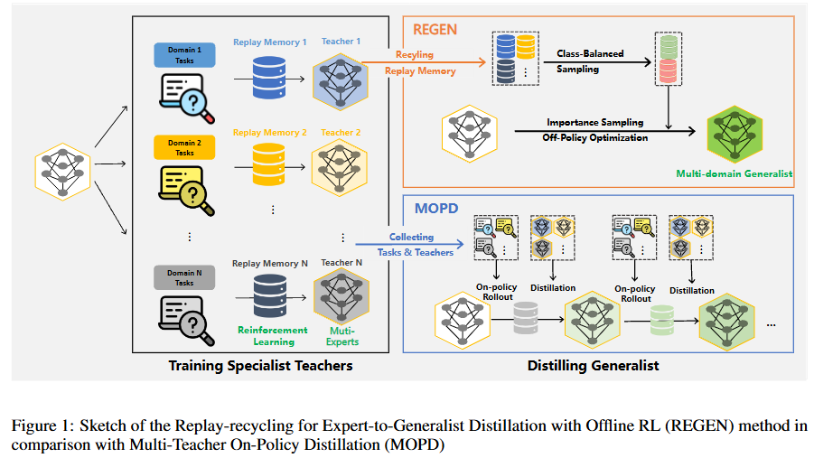
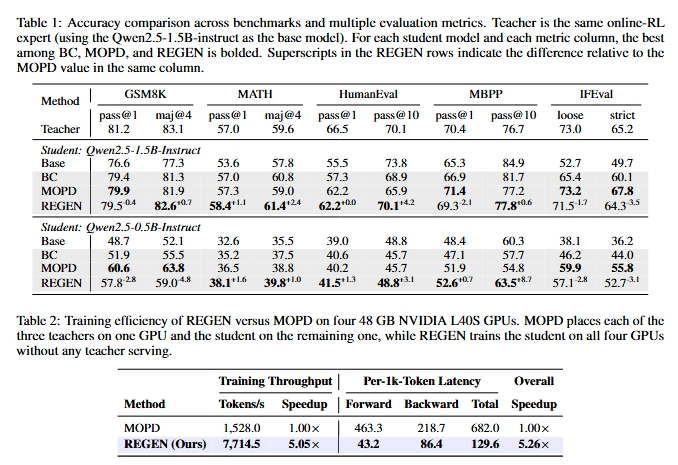

<div align="center">

<h1> REGEN: Replay-recycling for Expert-to-Generalist distillation with Offline Reinforcement Learning </h1>

<h5 align="center"> If you find this project useful, please give us a star🌟.

<h5 align="center"> 

<a href='https://arxiv.org/abs/2607.19450'></a>

Yunjie Chen, Xiaoxin Chen, Fang Wang<sup>*</sup>

<sup>*</sup>Corresponding to: fanwang.px@gmail.com

</h5>
</div>

## News
- [x] **`July 21, 2026.`** We release our paper on [arxiv](https://arxiv.org/abs/2607.19450).

## Abstract

Large-scale online reinforcement learning (RL) is the predominant means of eliciting advanced abilities including long-term reasoning and agentic tool use in large language models (LLMs). However, continuing to scale it across vast task domains of interest remains challenging in both computational infrastructure and cost, especially when considering RL as merely a one-off learning stage. Recently, a widely used technique for distilling knowledge across various domains and training stages, multi-teacher on-policy distillation (MOPD), helps to decouple the RL stage, saving costs, while maintaining generality across vast domains. Nonetheless, similar to online RL, MOPD requires coupled inference and backward passes, which continues to limit its scalability and computational efficiency. To address these challenges, we propose REGEN: Replay-recycling for Expert-to-Generalist Distillation with Offline RL. Instead of distilling from multiple teacher models, REGEN trains a generalist by simply recycling the replay memory -- the free by-product of the teachers' specialized RL training -- and employing offline RL algorithms. REGEN completely decouples the rollout sampling from the backward training process and thus greatly reduces the training cost. Across mathematical reasoning, code generation, and instruction following, REGEN matches the accuracy of MOPD at substantially lower cost. It potentially turns online RL into a data synthesis process instead of a one-off learning stage, and can potentially be extended to large-scale post-training without requiring heavy computational load.

<div align=center>

</div>

## Training

### Data Preparation

The training data is extracted from the replay buffer during the online process. Each sample is a quadruplet extracted from the online trajectory:

- **Query** `x`: The input prompt
- **Response** `y`: The generated response
- **Reward** `r`: The reward for the response
- **NLL** `z`: The negative log-likelihood (NLL) of the response under the rollout old-policy

These four elements form the basis of the training data.

The training data should be a trajectory dataset (parquet format recommended) containing the following columns:

| Column | Type | Description |
|--------|------|-------------|
| `prompt` | str | The query `x` |
| `response` | str | The response `y` |
| `advantage` | float | The recomputed advantage of `y` (**Note**: this is the recomputed advantage, not the raw reward `r`) |
| `nll_seq` | float | The NLL `z` of the response under the rollout old-policy |
| `origin_label` | str | "positive" or "negative" indicating whether the sample is a positive or negative sample |

#### Example

```json
{
    "prompt": "Calculate the sum of 1 and 2.",
    "response": "To calculate the sum of 1 and 2, we add them together: 1 + 2 = 3.\nThe answer is \\boxed{3}.",
    "nll_seq": 123.456,
    "advantage": 1.0,
    "origin_label": "positive"
}
```

### Offline RL Training

#### Installation

```bash
pip install -r requirements.txt
```

#### Training

To start training, run the following command:

```bash
cd REGEN
bash bash_scrips/qwen2_5_1.5b_regen.sh
```

## Main Results
We evaluate REGEN across three domains—**Math** (GSM8K, MATH), **Code** (HumanEval, MBPP), and **Alignment** (IFEval)—using Qwen2.5-1.5B-Instruct as the base model. REGEN is compared against Behavior Cloning (BC) and Multi-Teacher On-Policy Distillation (MOPD).

<div align=center>

</div>

- REGEN performs on par with MOPD across all benchmarks while substantially outperforming BC, particularly on Code and Alignment.
- REGEN achieves competitive accuracy with considerably higher training efficiency than MOPD, as it eliminates the need for online teacher inference during training.
## Acknowledgment

Our work is built on the following codebases, and we are deeply grateful for their contributions.

- [verl](https://github.com/volcengine/verl)
- [math-evaluation-harness](https://github.com/ZubinGou/math-evaluation-harness)
- [evalplus](https://github.com/evalplus/evalplus)
- [instruction_following_eval](https://github.com/google-research/google-research/tree/master/instruction_following_eval)

## Citation

If you find our paper related and useful to your research, please cite our paper:

```
@article{chen2026regen,
    title={REGEN: Replay-recycling for Expert-to-Generalist distillation with Offline Reinforcement Learning},
    author={Chen, Yunjie and Chen, Xiaoxin and Wang, Fang},
    year={2026},
    url={https://arxiv.org/abs/2607.19450}
}
```
